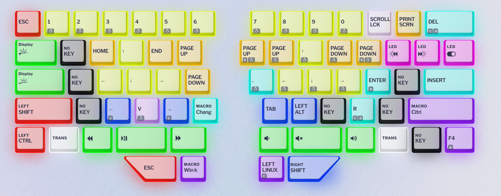
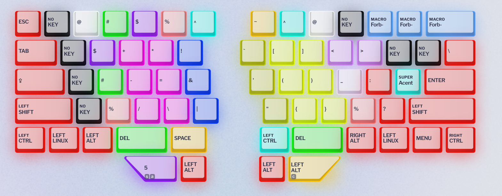

# Dygma Raise configuration

Making some notes about the configuration, for my future self (understand why I did something, before changing it). The official nomenclature for the 8-split spacebar is T1~T8, left to right & top to bottom.  
&nbsp;  
In all layers, white keys are for layer swap. I use "one shot layer" keys for Function keys and OS functions, these work as "shift to layer" when held, and if I need to lock the layer I can double tap (eg to use cursor keys). For other layers I have dual function keys (details below).  
LED off means the key is unassigned, so I know what I have available at a glance.  
&nbsp;  
Changes to this setup happened naturally on my first month of use, and as I grew more used to dual function keys. The most important lesson was to keep the key that I use to activate a layer opposite to the features I use the most without locking on it, in particular for things that aren't a quick tap.  
&nbsp;  
Currently I'm on revision 6, which removed Windows-only layers and replaced them with a few Win-specific keys here and there. It pays off to have the same arrangement for home and work use.  
I also have now a "standard" (or, gaming) layer with most keys in their default position.  

## General settings

These are values for the "Preferences" section, that controls timeouts for dual functions and mouse keys speed.

### Typing

  * Dual function overlap threshold: 40
  * Dual function hold timeout: 105
  * Superkey overlap threshold: 20
  * Superkey next tap timeout: 200
  * Superkey hold timeout: 175

### Mouse

  * Cursor speed: 20
  * Cursor acceleration: 20
  * Max cursor speed: 140
  * Wheel speed: 4

## Layer 1 - "Base"

From my MD770 days I got used to having modifiers in my thumbs (Space/Control on the left spacebar, and ESC/Control on the right spacebar), which is very convenient for Emacs. I'm keeping that in the Raise, in T2 and T3.  
T1 is F6, which is bound to my personal keymap in Emacs. T4 is backspace.
The thumbs keys in the bottom row are all layer changes, with some extra features:
  * T5 goes to layer 3, OS/window management, arrow keys, media
  * T6 has dual function: Enter on tap, activate layer 4 on hold (symbols for programming and compose key in Gnome to type with accented characters for Spanish)
  * T7 activates layer 5. It is almost identical to the base but most keys have the shift modifier. This frees up both shift keys on the sides and makes chording for shift use the thumb instead of pinky finger
  * T8 goes to layer 2, Function keys, browser/app shorcuts, and mouse keys
&nbsp;  
I still need proper Alt modifiers for other applications, but since I can trigger Control and Shift with thumbs and layers, I can repurpose those keys and a few others:   

* Left control: Jump to Excel layer
* Right control: Change language macro
* Caps Lock: C-x (Control+x) for Emacs
* Left shift: Prefix argument (C-u) for Emacs
* Right shift: Negative argument (C--), so now using `cycle-spacing` to collapse empty lines is a breeze
* Enter: F5, a secondary personal prefix key for Emacs commands (initially for registers, but expanded over time for more tasks).
* Backspace: Lock to layer 7, AKA "standard layer"
* Right Win key: one shot layer 3, an alternative to T5.

## Layer 2 - "F-keys/Browser/Mouse"

Since I activate this layer on the right side, it has arrows on left side, but with the Alt modifier applied. They can be used to move between chats in Signal and Discord, for example. In addition, around the arrows there's a couple Firefox-oriented bindings: Ctrl+Shift+Tab and Ctrl+Tab to move between tabs, Ctrl+Shift+T to reopen the last tab, etc.  
The right side has mouse keys, which I would use locking the layer (so having both activation and keys on the same side is not as uncomfortable). Mouse buttons to click are on the sides of "up" plus thumb keys, middle click below the arrows, the scrool wheel on the side. After adjusting the settings for mouse speed and acceleration, this setup has been convenient here and there.  
Finally, the number row is for F-keys, so this layer has the same modifiers as Layer 1 plus Shift keys on their usually positions, to allow for Ctrl+F1, Shift+F1, etc.  

## Layer 3 - "OS/Arrows/Media"

This layer has seen major changes in the last revision: swapped types of arrows on each side of the keyboard, and also added some Windows-specific keys here.  
The number row has the Win/Super modifier applied. The only reason I still need a Windows key in the base layer is for things like Win+V for clipboard history. I rely _a lot_ on the Win+# shortcuts to move between applications. I also use Win+arrows in Gnome Windows to tile and maximize applications. These are on the right half mapped to IJKL. Gnome workspaces shortcuts live on top of the arrow/move windows keys. I don't use multiple monitors anymore, so the keys to send monitors directly to one could (might?) be repurposed.  
On the left side there are arrow keys mapped to ESDF, surrounded by Home/End/PageUp/PageDown. A lot of times, moving with arrows implies expanding text selections (when not in Emacs, at least) so the layer also has shift and control keys in their usual positions. I am also experimenting with arrows to move left & right by word (with Control modifier applied) right below the regular arrows.  
Finally since I used the media keys on my MD770 a lot, I am mapping playback and volume in (and around) the T1~4 keys in the top row.  
I moved Alt+F4 from T7, where I tapped it accidentally, first to right shift, and now down to right control.  Win/Super is still in T6. Now T7 is Win+Control, lets me use the number keys to "pick the other window" for applications with more than one in Windows.  
As part of the consolitation of layers between Win and Linux, I now have a number of turquoise-colored keys that are mostly Windows oriented: from adding emoji (Win+.) to a pair of keys to use Alt+TAB using my index and middle fingers, to Ctrl+Alt+Del and Ctrl+Esc.  

## Layer 4 - "Symbols"

Here I mapped symbols that are useful for programming and moved them to keys close to the home row. Braces, parenthesis (obviously), math symbols, all types of quotes, etc.   
There are rev4 additions to this layer: `'` and `~` are mapped with the compose modifier (the solo `'` has custom location with all other quote types), some more programming symbols, and DEL in the location that has Backspace in layer 1 (T4 key).  
Revision 6 adds more alternatives for symbols that are used with Shift+Number and are common in programming or Emacs. For example a lower % sign, or a second @ in the left side. I keep tweaking these over time, depending on how much I use them.

## Layer 5 - "Base + Shift"

This is mostly the same as layer 1, but keys have the shift modifier applied. Including Enter and TAB. Backspace is mapped to the super key for accented characters, in case I have to type an uppercase Á :)  
In the revision 6 I added an extra Alt modifier, and colored some keys to better differentiate them, since I don't use them as often.

## Layer 6 - "Excel (and numpad)"

It finally happened. This layer came to life after I had to work for a couple hours on spreadsheets. It is intended to be used locked, having on the left side arrows in the ESDF position, with easy undo/redo in Z and Q. It also has a convenient Alt+= for the "SUM in range" shortcut in the 6 key.  
The right side has a numpad, with backspace bumped one row down (to make room for 0), next to delete and Esc. Basically everything I need to quickly move around cells and edit them.  
This is the layer that started the process of swapping my original arrangement for layer 3 - Numpad really belongs on the right side, and having arrows on different halves depending on the layer was annoying. I also added a bunch of keys around the arrows with common Excel shortcuts, color coding keys since I don't use this layer that much. The NumPad has been a success for TOPT codes though.

## Layer 7 - "Standard/Gaming"

After trying to configure a game and realizing you can't really use C-u as a command :) I created this layer. It is the "standard" keyboard, but I added Esc in the thumb cluster so I don't lose ` to map it. In addition the cluster can change to the 2 and 5 layers just like in the base one for quick access to shifted keys and F-keys.
