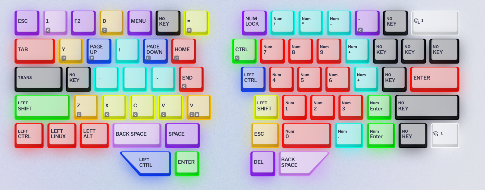

# Dygma Raise configuration

Making some notes about the configuration, for my future self (understand why I did something, 
before changing it). The official nomenclature for the 8-split spacebar is T1~T8, left to right & 
top to bottom.  
&nbsp;  
In all layers, white keys are for layer swap. I use "one shot layer" keys for Function keys and OS 
functions, these work as "shift to layer" when held, and if I need to lock the layer I can double 
tap (eg to use cursor keys). For other layers I have dual function keys (details below).  
LED off means the key is unassigned, so I know what I have available at a glance.  
&nbsp;  
Changes to this setup happened naturally on my first month of use, and as I grew more used to dual 
function keys. The most important lesson was to keep the key that I use to activate a layer opposite
to the features I use the most without locking on it, in particular for things that aren't a quick 
tap.  
&nbsp;  
I made a major overhaul in early 2025. Waiting for a deploy to complete at work, end of day, I
started wonder, "what if I changed..." and the rest is history. That overhaul had a few tweaks in
the following days, but it is now  mostly stable, which is why it is time to update the notes.  
&nbsp;  
The biggest issue I had with my previous setup was the dual function of the Enter key: it also
activated the symbol layer on hold, which meant I had a lot of messages sent in chats mid-editing.  
Another pain point was no thumb Alt key. I used Esc as a replacement within Emacs, but that didn't
help in other applications. Dygma implemented "one shot modifiers" though, which means I can now tap
Alt and Ctrl and keep them active until I press the next key. This is a powerful tool to mimic my
previous usage of Esc. I can even combine modifiers for the next key by tapping them both.

## General settings

These are values for the "Preferences" section, that controls timeouts for dual functions and mouse
keys speed.

### Typing

  * Dual function overlap threshold: 40
  * Dual function hold timeout: 105
  * Superkey overlap threshold: 20
  * Superkey next tap timeout: 200
  * Superkey hold timeout: 175

### Mouse

  * Cursor speed: 20
  * Cursor acceleration: 20
  * Max cursor speed: 140
  * Wheel speed: 4

## Layer 1 - "Base"

From my MD770 days I got used to having modifiers in my thumbs (Space/Control on the left spacebar, 
and ESC/Control on the right spacebar), which is very convenient for Emacs.  
In my updated setup mentioned in the intro, I changed the dual Esc/Control in T3 for a one-shot
Control, and T7 for one-shot Alt.  
T1 is F6, which is bound to my personal keymap in Emacs. T4 is backspace. But if I hold either of
these, I get access the layer for programming symbols. But I use them for prose too, out of muscle 
memory.  
Thumb keys T5 and T8 are `C-u` and `C--g`, the Emacs prefix arg and negative arg, respectively.  
&nbsp;  
I can repurpose some of the bottom row keys and other modifiers:  
* Left control: (no key - yet)
* Right control: Super key, tap to lock the Excel+Numpad layer, double tap for Gaming layer.
* Left shift: Esc when tapped, Shift when held.
* Right shift: one shot Shift. Which means that if I double tap it, it works as CapsLock.
* Caps Lock: C-x (Control+x) for Emacs
* Enter: F5, a secondary personal prefix key for Emacs commands (initially for registers, but expanded over time for more tasks).
* Win keys: one shot layer 3 - OS layer.
* Right Alt: one shot layer 2 - Browser.

## Layer 2 - "F-keys/Browser/Mouse"

Since I activate this layer on the right side, it has arrows on left side, but with the Alt modifier
applied. They can be used to move between chats in Signal and Discord, for example. In addition,
around the arrows there's a couple Firefox-oriented bindings: Ctrl+Shift+Tab and Ctrl+Tab to move
between tabs, Ctrl+Shift+T to reopen the last tab, etc. There's also a dedicate Ctrl+Shift+L key for
Bitwarden's auto-complete in web pages.  
The right side has mouse keys, which I would use locking the layer (so having both activation and 
keys on the same side is not as uncomfortable). Mouse buttons to click are on the sides of "up" 
plus thumb keys, middle click below the arrows, the scrool wheel on the side. After adjusting the 
settings for mouse speed and acceleration, this setup has been convenient here and there.  
Finally, the number row is for F-keys, so this layer has the same modifiers as Layer 1, to allow for
Ctrl+F1, Shift+F1, etc.

## Layer 3 - "OS/Arrows/Media"

The last round of changes, I swapped types of arrows on each side of the keyboard, to have arrows on
the same side in Excel and here. Now the adjustments have been pretty minor, mostly quality of life.  
The number row has the Win/Super modifier applied. The only reason I still need a Windows key in the
base layer is for things like Win+V for clipboard history. I rely _a lot_ on the Win+# shortcuts to
move between applications. I also use Win+arrows in Gnome Windows to tile and maximize applications.
These are on the right half mapped to IJKL. Gnome workspaces shortcuts live on top of the arrow/move 
windows keys. I don't use multiple monitors anymore, so the keys to send monitors directly to one 
could (might?) be repurposed.  
On the left side there are arrow keys mapped to ESDF, surrounded by Home/End/PageUp/PageDown. A lot
of times, moving with arrows implies expanding text selections (when not in Emacs, at least) so the 
layer also has an extra thumb shift to extend selections. I am also using more often the "arrows to
move by word" (with Control modifier applied) right below the regular arrows.  
Finally since I used the media keys on my MD770 a lot, I am mapping playback and volume in (and 
around) the T1~4 keys in the top row.  
I moved Alt+F4 from T7, where I tapped it accidentally, first to right shift, and now down to right 
control.  Win/Super is still in T6. Now T7 is Win+Control, lets me use the number keys to "pick the
other window" for applications with more than one in Windows.  
As part of the consolidation of layers between Win and Linux, I now have a number of 
turquoise-colored keys that are mostly Windows oriented: from adding emoji (Win+.) to a pair of keys
to use Alt+TAB with my index and middle fingers, to Ctrl+Alt+Del and Ctrl+Alt+R (react with emoji in
MS Teams).  

## Layer 4 - "Symbols"

Here I mapped symbols that are useful for programming and moved them to keys close to the home row.
Braces, parenthesis (obviously), math symbols, all types of quotes, etc.   
There were rev4 additions to this layer: `'` and `~` are mapped with the compose modifier (the 
solo `'` has custom location with all other quote types), some more programming symbols, and DEL in
the position that has Backspace and F6 in layer 1 (T4 key and T1 key, respectively).  
Revision 6 added more alternatives for symbols that are used with Shift+Number and are common in
programming or Emacs. For example a lower % sign, or a second @ in the left side. I keep tweaking 
these over time, depending on how much I use them.  
The latest addition is a `M-%` key, to run `query-replace` or `query-replace-regexp` directly, plus
re-arranging all the lower row to have "standard" order.

## Layer 5 - "Base + Shift"

This used to be a layer to type uppercase, shifted characters, etc. but it is now gone, thanks for
regular shift positions in the base layer, plus one of them being one shot (so I can lock it).

## Layer 6 - "Excel (and numpad)"

It finally happened. This layer came to life after I had to work for a couple hours on spreadsheets.
It is intended to be used locked, having on the left side arrows in the ESDF position, with easy
undo/redo in Z and Q. It also has a convenient Alt+= for the "SUM in range" shortcut in the 6 key.  
The right side has a numpad, with backspace bumped one row down (to make room for 0), next to delete
and Esc. Basically everything I need to quickly move around cells and edit them.  
This is the layer that started the process of swapping my original arrangement for layer 3 - Numpad
really belongs on the right side, and having arrows on different halves depending on the layer was
annoying. I also added a bunch of keys around the arrows with common Excel shortcuts, color coding
keys since I don't use this layer that much. The NumPad has been a success for TOPT codes though.

## Layer 7 - "Standard/Gaming"

After trying to configure a game and realizing you can't use C-u as a command (back when shift was
C-u...) I created this layer :)  
It is the "standard" keyboard, but I added Esc in the thumb cluster so I don't lose ` to map it. In
addition the cluster has keys to acess the F-keys and OS-keys (for more bindings, to control
volume, etc). I am not sure about the change, but the intention of F5 and F6 in the cluster if to
quick load/save. Time will tell if I use those...

