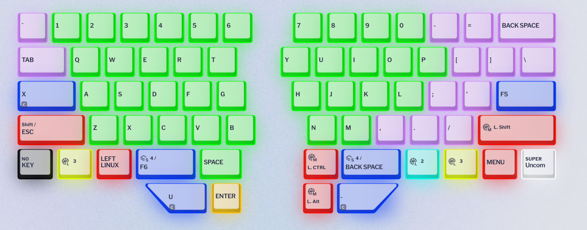

# Dygma Raise configuration

Making some notes about the configuration, for my future self to understand what the hell was the idea. The official nomenclature for the 8-split spacebar is T1~T8, left to right & top to bottom.  
&nbsp;  
In all layers, white keys are for layer swap. I use "one shot layer" keys for Function keys and OS functions, these work as shift to layer when held, and if I need to lock the layer I can double tap (eg to use cursor keys). For other layers I have dual function keys (details below).  
LED off means the key is unassigned, so I know what I have available at a glance.  
Currently I'm on revision 3 of the setup, changes happened naturally on my first month of use and as I grew more used to dual function keys. The most important lesson was to keep the key that I use to activate a layer opposite to the features I use the most without locking on it, in particular for things that aren't a quick tap.

## General settings

These are values for the "Preferences" section, that controls timeouts for dual functions and mouse keys speed.

### Typing

  * Dual function overlap threshold: 80
  * Dual function hold timeout: 150
  * Superkey next tap timeout: 150
  * Superkey hold timeout: 150

### Mouse

  * Cursor speed: 25
  * Cursor acceleration: 50
  * Max cursor speed: 100
  * Wheel speed: 4

## Layer 1 - "Base"

From my MD770 days I got used to having modifiers in my thumbs (Space/Control on the left spacebar, and ESC/Control on the right spacebar), which is very convenient for Emacs. I'm keeping that in the Raise, in T2 and T3.  
T1 is F6, which is bound to my personal keymap in Emacs. T4 is F5, which holds a second keymap that for the time being is exclusively assigned to registers.  
The thumbs keys in the bottom row are all layer changes, with some extra features:
  * T5 goes to layer 3, OS/window management, arrow keys, media.
  * T6 has dual function: Enter on tap, activate layer 4 on hold (symbols for programming)
  * T7 also has a dual function: backspace on tap, activate layer 5 on hold. This layer is almost identical to the base but most keys have the shift modifier. This frees up both shift keys on the sides and makes chording for shift use the thumb instead of pinky finger.
  * T8 goes to layer 2, Function keys, browser/app shorcuts, and mouse keys
&nbsp;  
I still need proper Alt modifiers for other applications, but since I can trigger Control and Shift with thumbs and layers, I can repurpose those keys and a few others:   

* Left control: Switch keyboard language. Uses a macro that does the shortcut for Linux (Ctrl+Alt+\`) and Windows (Alt+Shift) combined.
* Right control: For the time being, macro to exit Citrix VDI when it is full screen.
* Caps Lock: Lock layer 5, which is more or less like having a Caps key, with modifiers other than shift in a few particular keys.
* Left shift: Prefix argument (C-u) for Emacs commands.
* Right shift: Negative argument (C--). Now using `cycle-spacing` to collapse empty lines is a breeze.
* Function key: Print Screen
* Enter: Delete

## Layer 2 - "F-keys/Browser/Mouse"

Since I activate this layer on the right side, it has arrows on left side, but with the Alt modifier applied. They can be used to move between chats in Signal and Webex, for example. In addition, around the arrows there's a couple Firefox-oriented bindings: Ctrl+Shift+Tab and Ctrl+Tab to move between tabs, Ctrl+Shift+T to reopen the last tab, etc. Also, the keys Z, X, C and V are mapped with a Control modifier for undo/copy/etc. This technically belongs, and it is mapped, in layer 3 too.  
The right side has mouse keys, which I would use locking the layer (so having both activation and keys on the same side is not as uncomfortable). Mouse buttons to click are on the sides of "up", middle click below, the scrool wheel on the side. After adjusting the settings for mouse speed and acceleration, this setup has been convenient here and there.  
Finally, the number row is for F-keys, so this layer has the same modifiers as Layer 1 plus Shift keys on their usually positions, to allow for Ctrl+F1, Shift+F1, etc.  

## Layer 3 - "Windows/Arrows/Media"

In this layer, the number row has the Win/Super modifier applied. The only reason I still need a Windows key in the base layer is for things like Win+V for clipboard history.
I rely _a lot_ on the Win+# shortcuts to move between applications. I also use Win+arrows in both Gnome and Windows to tile and maximize applications, and to move applications between monitors. These are on the left side as ESDF arrows, plus an extra left/right that adds shift. Again, not umcomfortable since I mostly tap these.  
Gnome workspaces shortcuts are mapped on top of the arrow/move windows keys.  
On the right side there are arrow keys mapped to IJKL, surrounded by Home/End/PageUp/PageDown. A lot of times, moving with arrows implies expanding text selections (when not in Emacs, at least) so the layer also has shift and control keys in their usual positions.
Finally since I used the media keys on my MD770 a lot, I am mapping playback and volume in (and around) the T1~4 keys in the top row.  
I also added Alt+F4 in T7, and Win/Super in T6, as quick shortcuts.

## Layer 4 - "Symbols"

Here I mapped symbols that are useful for programming and moved them to keys close to the home row. Braces, parenthesis (obviously), math symbols, all types of quotes, etc.

## Layer 5 - "Base + Shift"

This is mostly the same as layer 1. Majority of the keys have the shift modifier applied. Including Enter. But Backspace and Delete have Control applied instead (to remove full words).

