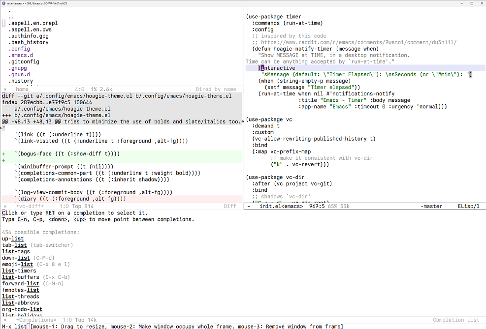

A place to store my keyboard and Emacs configuration. I used to have more things here, but I
simplified a lot of my setup.

## Emacs config

A [use-package](https://www.gnu.org/software/emacs/manual/html_mono/use-package.html) based
configuration, that tries its best to be platform agnostic.  
In most cases I prefer smaller packages, if built-in, even better (eg project.el over projectile). 
In the same spirit, I use Eglot for my LSP needs.  

I use my own theme, you can read a pseudo-justification [here, on my
blog](https://site.sebasmonia.com/posts/2025-04-15-why-i-wrote-my-own-emacs-theme.html).  
It has minimal syntax highlighting. Uses about 4 colors outside white, black and greys. And as
little as possible.

I also use a custom mode-line, based on [mood-line](https://gitlab.com/jessieh/mood-line) (a
text-variant of doom-modeline). I had enough little patches and additions to it that I figured I
might as well do my own thing. Which is of course more limited in scope, but tailored to the 
packages I use.  

My font of choice is [Berkeley Mono](https://berkeleygraphics.com/typefaces/berkeley-mono/).  

### Version numbers

Starting with Emacs 28, my config file version number will match the minimum Emacs version needed to
run it. I do my best to update the minor version on "big" changes.  

## Keyboard config

I have a Dygma Raise. There's a README with notes about the config, and exported JSON of my current
layers, in the corresponding sub-directory.  
&nbsp;  
There's a legacy setup using [Karabiner](https://karabiner-elements.pqrs.org/) for macOS, from when
I had a Mac at work.  
And another legacy setup with [KMonad](https://github.com/kmonad/kmonad) from before I had the Raise
and used a Mistel MD770 instead.

## Where this runs

### Home setup

Lenovo L390 Yoga running Fedora Silverblue, with just a few extensions installed:

* [Clipboard history](https://extensions.gnome.org//extension/4839/clipboard-history/): I got used
to having a clipboard history in Emacs, and in i3, now I need it in Gnome too.  
* [Tray icons reloaded](https://extensions.gnome.org//extension/2890/tray-icons-reloaded/): For
~~Slack~~ Discord, mostly.  
* Background logo, because it looks fancy.  

### Work setup

HP ZBook Power 15.6" G10 running Windows 11. Emacs compiled from source using MinGW, executed under
Win32, with native-comp.  
I could use WSL or a VM, but I'd rather not have one more layer of indirection (plus I used Windows
for so many years, I can find my way around it...).  

